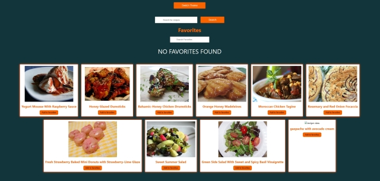

#  Cook-It-Up

## Project Overview:
I built a React-based food managing app as a practice project following the Udemy course "React JS Crash Course 2023 - Build A Food Managing App" (https://www.udemy.com/course/react-js-crash-course-2023-build-a-food-managing-app/), focusing on key React concepts such as state management, hooks, and API integration.

## Technologies Used:
*  **React:**  Utilized functional components to create reusable and modular UI elements.
*  **React Hooks:** Implemented various hooks like useState, useEffect, and useContext for state management and side effects.
*  **API Integration:** Fetched and displayed data from a remote API, allowing dynamic content updates.
*  **Local Storage:** Managed local state with localStorage, enabling persistent data between sessions.
*  **Google Firebase:** Deployed the app on Firebase for scalable hosting and real-time updates.

## Features & How They Work:

1. Theme Toggle:
 - ** What happens: **Users can switch between a light and dark theme by clicking the "Switch Theme" button. This toggles the background and title colors between green and orange.
 - ** How it's done:** The theme switch is managed using the `useContext` hook to pass theme-related data globally between parent and child components. This allows seamless communication and state sharing across the app without the need for prop drilling.
 -   
   - 
2. Recipe Search:
 - ** What happens:** Users type a query into the "Search for Recipes" input field, and after clicking "Search," recipes are fetched from the Spoonacular API. Each result is displayed as a card with an image, title, and an "Add to Favorites" button.
 - ** How it's done: **The search input is controlled using the `useState` hook, and the `API call` is triggered on button click. A loading state is handled using another piece of state to provide feedback during the `API request`.
3. Displaying Recipe Cards:
 - ** What happens:** After the search, a list of recipe cards appears on the screen. Each card contains an image, title, and an "Add to Favorites" button.
 - ** How it's done: ** Recipe data is passed from the parent component to the child components as props, showcasing how data flows in a React component tree. Child components can communicate with the parent to handle adding to favorites.
  - 
4. Add to Favorites:
 - ** What happens:** When a user clicks "Add to Favorites" on a recipe card, the recipe gets stored in the "Favorites" section below. It also includes a "Remove from Favorites" button for easy removal.
 - ** How it's done: ** `useState` and `localStorage` are used to persist the favorites even after the page reloads. The useEffect hook manages side effects, such as saving or removing items from local storage when the state changes.
5. Favorites Section & Search:
 - ** What happens: **The "Favorites" section displays all the saved recipes. Users can filter their favorites by typing in the "Search Favorites" input field.
 - ** How it's done: **The search filter for favorites is implemented using the `useReducer` hook, which handles the complex state of managing the favorites list and filtering results.
 - 
6. Performance Optimization:
 - ** What happens: **The app efficiently handles the list rendering and API fetching to avoid unnecessary re-renders, ensuring smooth performance.
 - ** How it's done: **Hooks like `useCallback` and `useMemo` are used to optimize the performance of the application, especially when dealing with larger lists of recipes and managing API responses.